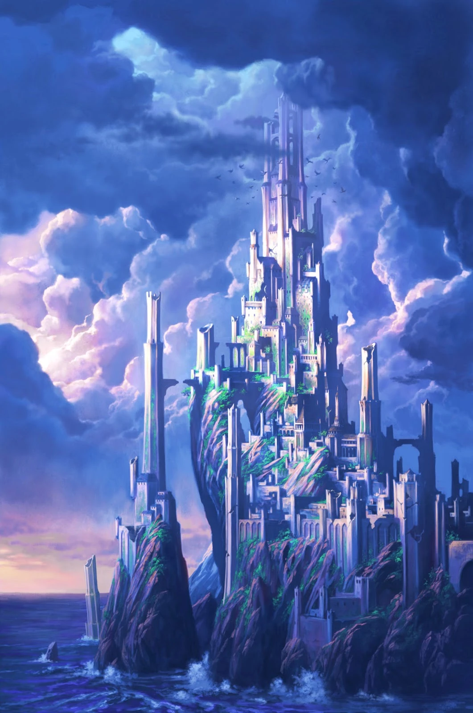
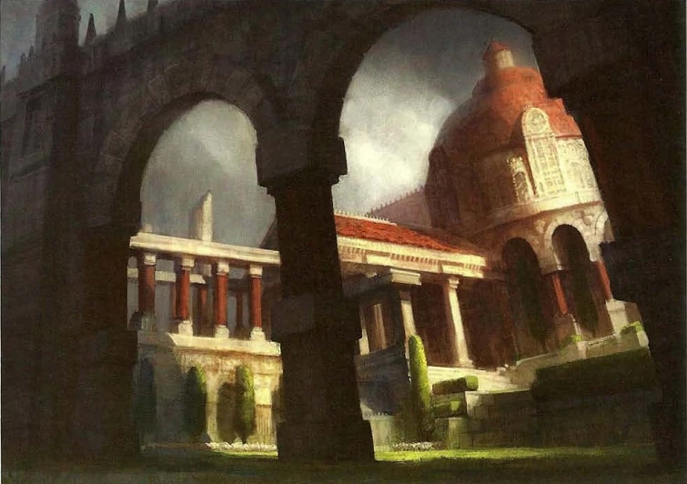
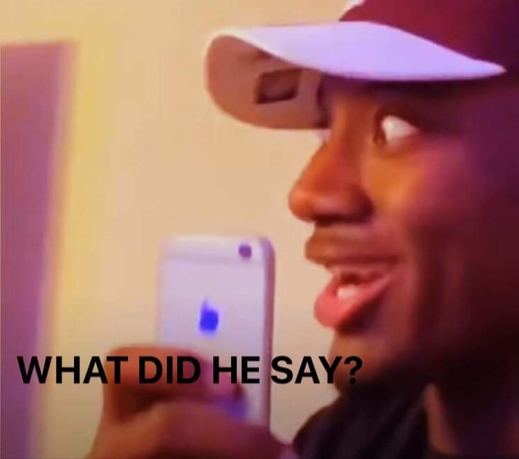

# Session 1

Azrael poofed up to the roof, and over the side, never to be seen again.  The rest of us gets manticled.  Azrael is currently trying to lower himself down the other side of the building.

Ramus tries to warn, Captain Shaw, about the Beast Tamer alliance.

Meanwhile Azrael is still on top of the wall, NO ONE SEES HIM, right?  RIGHT?  He unfurls his 50 ft of rope, which should get him most of the way down.  It does not go well, he slips like a dummy and lands flat on his back.  While flat on his back, he heres a voice from the shadows beckoning him. 21 21 21, he rolls over and sees a small humanoid figure, waving Azrael over to the alley.  Azrael cautiously approaches and sees a red headed halfling, is it Kaelen?  They are both aprehensive, with hands on blades.  He offers Azrael a place to hideout, he moves halfway down the alley and knock, knock knock knock, knock knocks on the ground and a steel trapdoor appears.

Its a basement, hole in the ground.  Dude lives here, Tavian is his name, and being a short shit is his game.  They start dating and sharing stories about Shaw. Offers Azrael to stay here as long as he needs.  Says the Zhentarim could use someone like him.

Trey almost spills his Blizzard....for shame.

Azrael explains the situation that happened at the Driftwood.  Tavian introduces himself as Tavian Dreymoor, known as Ghost.  Says the Zhentarim will be in touch, and says Azrael will receive the WiFi password to the network if he completes the given task.

Zoink back to the rest of the group....

We pass by...looks at the map....Number 1:  Castle Never.

We are still being perp walked.  Not many people out this time of the day, we take the long way around Castle Never, we pass by the Hall of Justice 

Gregor knows that the Hall of Justice is also a temple to a God...not sure which...but a God.  We find ourselves at the guard station.  We are led to the back where we are put in a room, a locked room, with rats...lots of rats...im not crazy.

We get unmanticled, and the questioning begins.

We talk for a bit when another guard comes in and W's Shaw.....

They found the symbol and the hand.  They ask us about it. Guard Captain stands up and leaves.  He comes back 30 minutes later, with the severed hand balled up into a fist.  On the hand is a golden signet ring, and asks if we recognize this at all?  Ramus digs deep in his grey matter and knows that it belongs to a noble house of Neverwinter. Name Embermere.  Ramus says that the signet belongs to the house that helped him as a child after his family died.  Lord Embermere helped Ramus survive on his own.  Lord Embermere has been missing for roughly 6 months.  The guards have been tearing Neverwinter apart trying to find him; however, they recently stopped the search.

The Guard opens the fist to reveal a desicated eyeball clutched in the fingers.  Kaelen notices that the eye is giving off latent magical energy.  Kaelen is escorted out of the room, shuts the door behind him.  On the other side of the door, there is a nervous, young, half elf.  The Captain throws the eyeball to him and tells Kaelen and the half elf to figure it out.

Bing boom boom boom bing boom bap pow....back to Azrael.

Azrael has been hiding for about two hours, cleaned himself up, and decides to look around the hideout.  Finds some maps, books, general diagrams of things.  He finds a blueprint of some large building.  Seems to be a blueprint to Castle Never.

Kaelen is introduced to Eric....the scared half elf.  He makes a deal with him to split the gold offered to solve the eyeball mystery.  Scams him into 80/20 split.  Kaelen copies Identify spell from Erics spell book.  ...ONE HOUR LATER...

Kaelen casts Identify on the eyeball, and learns that if you say Zhaer'thal valkuris the eye will glow green, float, and look in a direction, pointing to something.  He says the phrase, the eye glows, and points southward direction.

Captain offers the group 500 gold each if we can bring back the hooded man or proof of what caused the massacre before dawn.

Meanwhile, at the Azrael cave, he has now taken off his mask, cast disguise self -> 

He starts heading towards the guard tower.  Around 2:45 am he sees Rock and The Rollers leaving the building.  And they head straight east, deeper into the Protectors Enclave.

As we step out of the guards office thingy, we bump into WHITE AZRAEL, we make our way, following the eye, when Azrael drops the disguise and we explain whats happening.

We enter to one of the pockets of the city that is known as a ruin

>The city of Neverwinter stands proudly on the Sword Coast, west and north of Dessarin Valley. Fifty years ago, the city was nearly destroyed by the eruption of Mount Hotenow. Today, the city stands mostly rebuilt. It bustles with skilled tradespeople, intrepid adventurers, and hardy townsfolk.

At the end of one of the alleys is a bunch of rubble, and there is a tunnel being blocked by some moldering boards.

Gregor touches his staff... and casts light.

We travel through the tunnels, squeeze through a tight space, open a "secret" stone door, and find a sarcophagus.  

>BEN TO PROVIDE TEXT.

The sarcoph is covered with a six pointed crown.  It is the sigil for the Hallwinter family.  Gregor opens the coffin, and takes the shield.  We happen upon a ghost that is pacing in another room and he asks "I have lost who I am, do you know who I am?"  When given the name Hallwinter, he seems to respond positively, but asks for the whole name.

We continue on and find another room.  Has two crumbling pillars in the room, and 8 shambling undead, along with a desecrated shrine to Augma, God of Knowledge, Patron to Bards and Wizards.  Kaelen knows that this shrine would normally ward off undead.

Azrael asks me what the eye is doing, and it alerts the zombies.....INITIATIVE.....Gregor goes down, but we are victorious.  Gregor is brought back.

As we step deeper in the room, the eye glows brighter.

